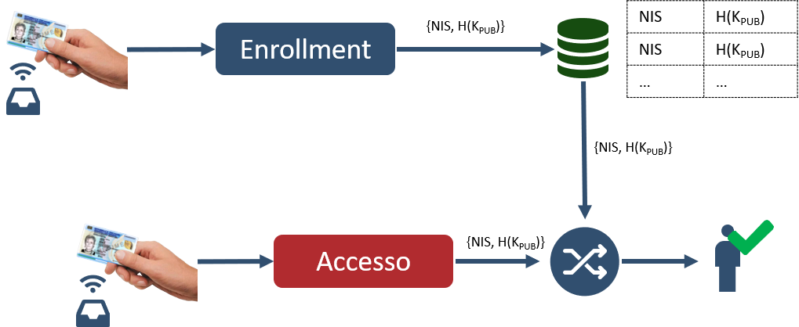
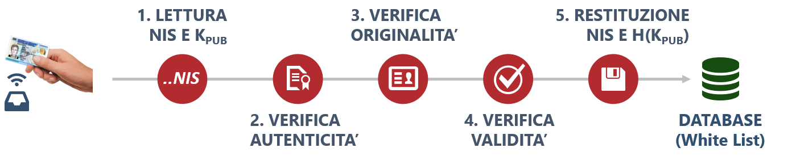
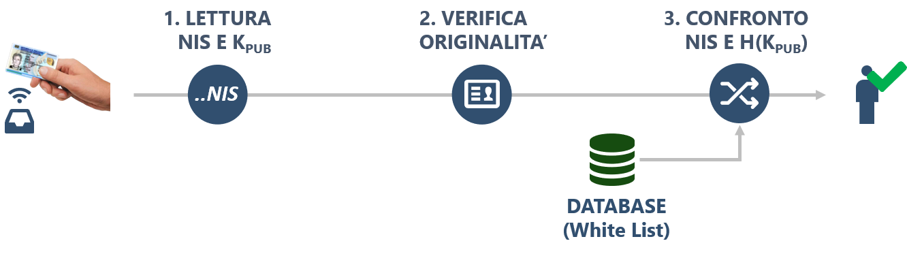

.. _enrollment:

=====================================================
Protocollo di registrazione ed accesso tramite NIS
=====================================================

L'abilitazione e la fruizione di un servizio tramite CIE avviene in due fasi:

   1. Fase di Enrollment
   2. Fase di Accesso

L'Enrollment consiste nella verifica della CIE e nella convalida del NIS controllandone l'autenticità, l'originalità e la validità e, in caso di esito positivo delle verifiche, abilitarlo alla fruizione del servizio. A valle delle verifiche, l'erogatore del servizio dovrà memorizzarsi il NIS e il valore di Hash della Chiave Pubblica H(K\ :subscript:`PUB`) restituiti dalla CieNIS-java-sdk. Questa fase prevede dunque di memorizzare nel proprio sistema due valori considerati, a valle delle verifiche, affidabili, ovvero:

La fase di accesso consente all'utente, precedentemente registratosi nella fase di Enrollment, di utilizzare la CIE per accedere al servizio fisico pinless. L'accesso avviene, ad esempio, su un tornello che, verificata l'originalità della CIE mediante i dati salvati in fase di Enrollment, ne autorizza l'accesso. In particolare il sistema verificherà se la coppia NIS e H(K\ :subscript:`PUB`) lette in accesso sono presenti nel proprio Database. Si riporta uno schema esemplificativo del protocollo.

   Protocollo di registrazione ed accesso.

Il processo di Enrollment
=========================

L'Enrollment è la fase in cui si procede all'associazione della propria CIE come carta di accesso ad un determinato servizio. In particolare il NIS della CIE, una volta autenticato e validato attraverso le verifiche precedentemente descritte, viene associato all'utente che ne richiede il servizio. Il processo di Enrollment deve essere eseguito una sola volta e può ritenersi valido fino alla revoca del servizio o fino alla revoca della CIE stessa. Tale processo può essere eseguito in due modalità:

   1. Enrollment Locale
   2. Enrollment Remoto 

Si parla di Enrollment di tipo locale quando la CIE viene presentata fisicamente e verificata presso un lettore messo a disposizione dal fornitore del servizio, ad esempio attraverso un totem aziendale, un lettore NFC connesso alla postazione di un operatore autorizzato dall'erogatore dei servizi. Questa modalità fa sì che le fasi di verifica avvengano direttamente sulla postazione presso la quale ci si sta registrando e il titolare della CIE utilizzi solo lettori e strumenti autorizzati e controllati dall'erogatore stesso. 

Si definisce altresì Enrollment di tipo remoto quanto la CIE viene presentata attraverso, ad esempio, lo smartphone del titolare della stessa, in modalità non direttamente sotto la supervisione del fornitore dei servizi. Tale modalità offre la flessibilità di una registrazione dell'utente direttamente in qualsiasi luogo, purchè lo stesso detenga uno smartphone dotato di tecnologia NFC e sia disponibile una connessione ad internet. 

Nei successivi paragrafi verranno descritte le modalità di integrazione delle due tipologie di Enrollment.

Enrollment Locale
--------------------------------------------------

L'Enrollment di tipo locale consente la verifica del NIS direttamente sul sistema di lettura e/o verifica messo a disposizione dal fornitore dei servizi per il quale il titolare della CIE si sta registrando. 

Requisiti Hardware:

   - **Lettore NFC**: Lettore NFC in grado di operare secondo lo standard ISO-14443;

Il processo di Enrollment viene schematizzato nella figura che segue.

   Schema di Enrollment Locale.

L'utente posiziona la CIE sul lettore NFC, dopodichè, il lettore esegue la lettura del NIS e del valore dell'Hash della chiave pubblica. In seguito vengono eseguite le verifiche di autenticità, integrità, originalità e validità, come descritto nelle sezione precedente. Se tutti gli step da 1 a 4 sono andati a buon fine, è possibile memorizzare il NIS e il valore di H(K\ :subscript:`PUB`) della CIE presentata. Tali dati dovranno essere inseriti nella White List del fornitore del servizio. 
La SDK CieNis-java-sdk sviluppata dal Poligrafico che implementa le verifiche di autenticità e originalità della CIE, restituendo il NIS e l'H(K\ :subscript:`PUB`), può essere scaricata dal seguente link: 

https://github.com/italia/cie-nis-java-sdk

Enrollment Remoto
--------------------------------------------------

*Non disponibile in questa versione.*

Il processo di Accesso
==========================

Il processo di accesso è la fase in cui l'utente, precedentemente registratosi all'utilizzo di uno specifico servizio, presenta la propria CIE al lettore per usufruire del servizio stesso. Se la fase di Enrollment è andata a buon fine, allora l'utente viene abilitato ad usufruire del servizio. 
La fase di accesso è caratterizzata dall'implementazione di un protocollo di verifica più "leggero" rispetto a quello di enrollment. Questo per far sì che tale fase possa impiegare pochi millisecondi e rendere il servizio di accesso fisico "veloce" e percepito con positività dall'utente finale. I minori step di verifica non vanno a discapito della sicurezza, in quanto già in fase di Enrollment sono stati svolti tutti i passaggi necessari per garantire la validità della CIE presentata. Le fasi di Enrollment e di Accesso vengono legate nel momento in cui, oltre al NIS, viene memorizzato il valore di H(K\ :subscript:`PUB`). In questo modo la chiave pubblica (con il relativo Hash) viene ritenuta affidabile. In fase di accesso, viene implementata la sola verifica di Internal Authentication che consente la verifica che la chiave pubblica letta corrisponda alla relativa chiave privata memorizzata nel chip. Infine il sistema del fornitore di servizi verifica che la coppia {NIS, H(K\ :subscript:`PUB`)} sia una delle coppie presenti nella WHITE LIST precedentemente memorizzate in fase di enrollement. 
Si riporta di seguito uno schema riassuntivo del protocollo di accesso. 

   Schema di Accesso.

Gli step descritti devono essere integrati sui lettori installati nei punti di accesso al servizio.  