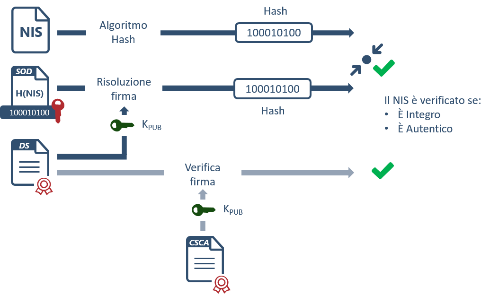
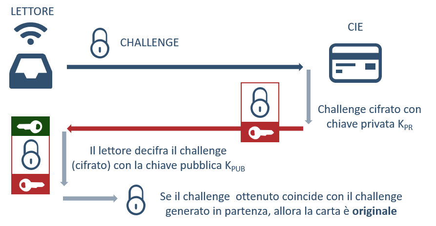
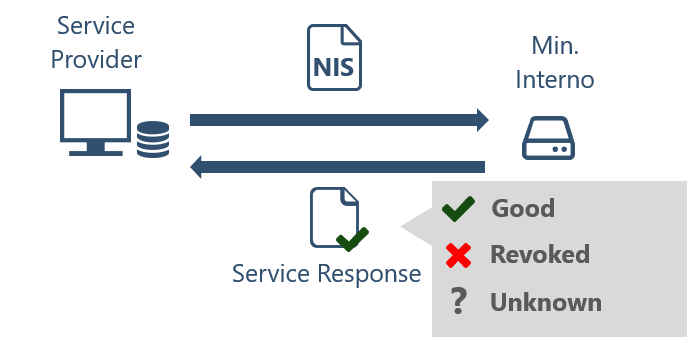

=======================================
Il Numero Identificativo Servizi (NIS)
=======================================

La `Carta d'identità elettronica 3.0 (CIE)  <https://www.cartaidentita.interno.gov.it/>`_ è il documento di identità rilasciato dal Ministero dell'Interno su richiesta dei cittadini per la certificazione della propria identità. Oltre ad essere un documento di riconoscimento è anche un documento di viaggio, conforme agli standard internazionali adottati anche per i passaporti e i permessi di soggiorno. Infine, consente l'accesso in sicurezza ai servizi digitali, mediante l'inserimento del PIN, erogati dalla Pubblica Amministrazione e dai privati anche in ambito europeo.

La CIE permette l'utilizzo di tre diverse tipologie di servizio che sono:

   - **Identità Digitale**:  tramite un certificato di autenticazione, accessibile solo mediante PIN, utilizzata per l'autenticazione ai servizi on-line;
   - **Identità Fisica**:  i dati di identificazione fisica dei cittadini, conformi allo standard dei documenti di viaggio ICAO 9303;
   - **Numero Identificavo Servizi (NIS)**: l'identificativo associato alla carta utilizzato per i servizi fisici di accesso veloce.

Il Numero Identificativo Servizi è un valore numerico univoco composto da 12 cifre, generato in fase di personalizzazione della CIE, dedicato appositamente alla fruizione di servizi ad accesso fisico veloce. Il NIS ha le seguenti caratteristiche:

   - E’ liberamente accessibile e leggibile senza l'uso di chiavi o PIN;
   - E’ associato univocamente ad ogni CIE;
   - Non è riconducibile direttamente al titolare del documento.

Il servizio di accesso tramite NIS può essere utilizzato, ad esempio, per l'accesso fisico ai luoghi pubblici, ai mezzi di trasporto, oppure per l'identificazione e la registrazione del dipendente in entrata ed uscita dai posti di lavoro in sostituzione del badge aziendale. 
Il NIS, all'interno del file system della CIE, viene memorizzato sotto il nome di ID Servizi (file EF.ID_Servizi).

Verifica della CIE
========================================================

Il vantaggio di utilizzare il NIS come identificativo di accesso ai servizi consiste nella possibilità leggere quest'ultimo liberamente e senza operazioni preliminari di autenticazione. E\' necessario adottare delle procedure che permettano comunque di verificarne l'integrità, la provenienza da una CIE originale, l'appartenenza ad una CIE autentica e, infine, l'appartenenza ad una CIE valida.  

Per evitare di abilitare ad un servizio un utente con documento non valido, contraffatto o revocato, è opportuno applicare le seguenti verifiche che consentano di mitigare tali rischi.

Verifica di Autenticità e Integrità
---------------------------------------------

A seguito della lettura del NIS, è necessario verificarne l'integrità e l'autenticità. Ciò significa attuare dei controlli che consentano di verificare che il dato letto sia effettivamente l'ID Servizi della CIE letta e che sia integro e autentico, cioè inalterato e firmato dal Ministero dell'Interno. A garanzia dell'autenticità e integrità del dato, il NIS memorizzato nella CIE, oltre ad essere liberamente accessibile, è firmato digitalmente e memorizzato in un apposito file insieme al certificato digitale (certificato DS) che contiene la chiave pubblica per la verifica della firma applicata dallo stesso Document Signer. 
Tale certificato, a sua volta, è firmato dalla `Country Sign Certification Authority (CSCA) <https://csca-ita.interno.gov.it/>`_, che attesta l'autenticità del Document Signer. Durante la fase di lettura e verifica di autenticità, il sistema che effettua tale operazione deve poter recuperare dinamicamente o aver memorizzato localmente il certificato emesso dalla CSCA ai fini della verifica di autenticità del certificato DS. 
La verifica di autenticità del NIS consiste essenzialmente di due step:
   1. Verifica dell'integrità del NIS, tramite l'internal authentication'
   2. Verifica dell'autenticità del NIS, tramite la verifica del SOD e dei certificati
Se entrambe le verifiche vanno a buon fine, allora il NIS è autentico. Di seguito si riporta uno schema esemplificativo del flusso di verifica.

   Schema di verifica di autenticità e Integrità del NIS.

Verifica di Originalità
---------------------------------------------

Il NIS letto, seppur precedentemente autenticato, potrebbe provenire da una CIE clonata. La verifica di originalità consiste nel controllare che la CIE presentata al lettore sia effettivamente la CIE originale emessa dal Ministero dell'Interno. Si attua un processo di Internal Authentication, di cui uno schema esemplificativo di funzionamento è riportato qui di seguito. 

   Schema di verifica di originalità della CIE.

Nella fase di Internal authentication il chip della CIE deve autenticarsi verso il lettore, dimostrando di possedere la chiave privata corrispondente ad una chiave pubblica ritenuta affidabile dal lettore stesso (dato integro e affidabile) (ref. `Verifica di Autenticità e Integrità`_).
Il lettore legge la chiave pubblica e avviene un protocollo challenge/response in cui il chip firma un challenge ottenuto dal lettore.
Il lettore verifica la correttezza del challenge firmato nella response per assicurarsi che non sia in atto un attacco di Man In The Middle e per assicurarsi che il chip possieda una chiave privata affidabile la cui componente pubblica è firmata nel SOD.

Verifica di Validità
---------------------------------------------

Tale verifica consiste nel determinare se la CIE, autentica ed originale, sia ancora valida. Una CIE, infatti, può essere scaduta o revocata in seguito a furto o smarrimento.

.. nota::  In caso di furto o smarrimento è necessario che il titolare del documento abbia sporto regolare denuncia, così che le autorità competenti possano avviare la procedura di revoca del documento.

Una CIE scaduta non presenta particolari rischi legati alla sicurezza (si richiede comunque un rinnovo al legittimo titolare), una CIE revocata invece può essere detenuta da soggetti fraudolenti con l'intento di utilizzarla sostituendosi ai legittimi titolari del documento ed accedere ai servizi fisici ai quali risulta abilitata. 

*La verifica di validità della CIE non è disponibile in questa versione.*

   Schema di verifica di validità della CIE.

.. 
   _so:Un servizio (XXX) messo a disposizione dal Ministero dell'Interno, permette di verificare se il NIS che si sta processando appartiene ad una CIE revocata o meno